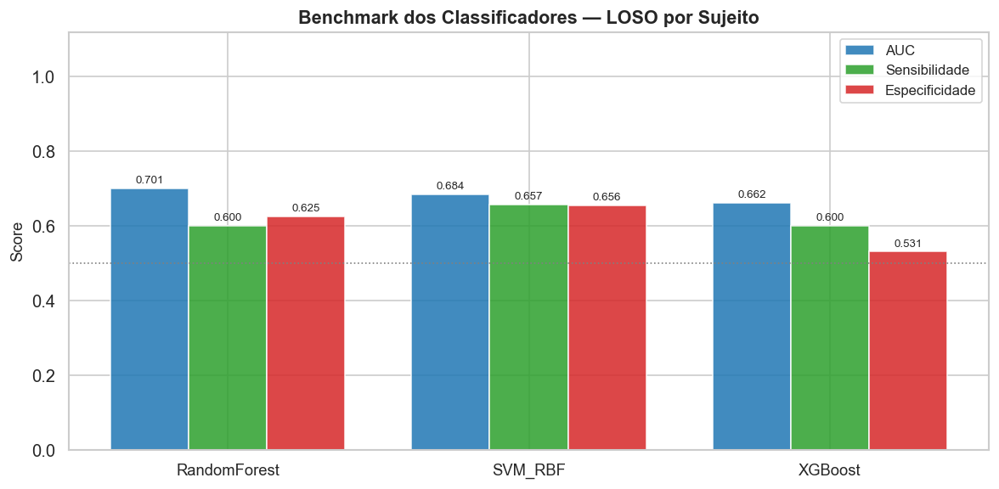
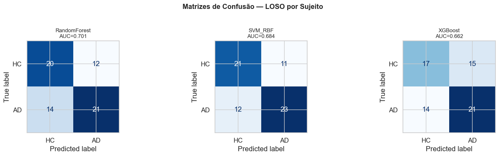
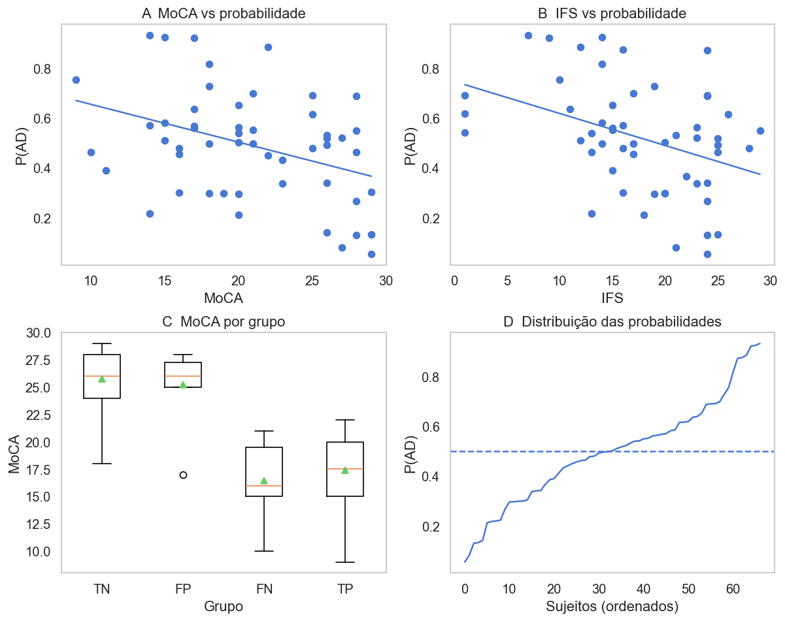
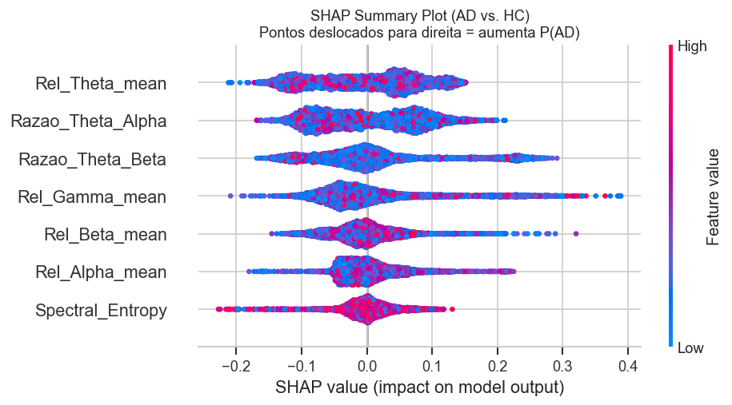

# 🧠 EEG-Based Machine Learning Pipeline for Alzheimer’s Disease Detection

This repository contains a binary classifier for **Alzheimer’s Disease (AD) vs. Healthy Controls (HC)** based on **EEG spectral features**, evaluated with **Leave-One-Subject-Out (LOSO)** validation and explained with **SHAP**.

This repository implements the following workflow based on the data from this article: https://doi.org/10.1038/s41597-023-02806-8

1. Download/preparation of the BrainLat dataset (https://www.synapse.org/Synapse:syn51549340/files/);
2. Pre-processing of EEG signals;
3. Extraction of spectral features;
4. Benchmarking of machine learning models (SVM-RBF, Random Forest, XGBoost);
5. Interpretability analysis and relationship with cognitive data.

## Overview

The goal of this project is to distinguish subjects with Alzheimer’s disease from healthy controls using resting-state EEG. The pipeline was designed to reduce data leakage and to evaluate performance at the **subject level**, not only at the epoch level.

### Main methodological choices

- **Subject-level LOSO validation:** each fold leaves one complete subject out for testing.
- **Training-only normalization:** prevents data leakage from test data into scaling.
- **Subject-level prediction:** the final decision is obtained by averaging epoch probabilities.
- **Literature-based spectral features:** relative band power, spectral ratios, and spectral entropy.
- **Explainability:** SHAP, error analysis, and partial dependence plots.
- **Sanity tests:** permutation testing, leakage auditing, baseline comparison, and feature discriminability checks.

---

## Repository Structure

```text
.
├── 1_Download_Datatset.ipynb
├── 2_Preprocessing.ipynb
├── 3_ML_Models.ipynb
├── README.md
├── assets/
│   ├── Beanchmark_Resultados.png
│   ├── matriz_de_confusão.png
│   ├── Cognitive_data.png
│   ├── Importancia_Reatures_SHAP.png
│   └── Shap_Summary.png
└── Dataset_EEG_Alzheimer/
    ├── dataset_eeg_alzheimer/
    │   ├── *.set
    │   └── *.fdt
    └── dataset_eeg_hc/
        ├── *.set
        └── *.fdt
```

## Expected Output Files

The notebooks generate:

- `eeg_features_brainlat_FULL_normalizado.csv`
- `eeg_features_brainlat_falhas_normalizado.csv`

---

## Requirements

The notebooks were written in Python 3.12.10 and use common scientific and EEG libraries.

### Main dependencies

- `numpy`
- `pandas`
- `matplotlib`
- `seaborn`
- `mne`
- `scikit-learn`
- `xgboost`
- `shap`
- `neuroCombat` *(optional)*

### Suggested installation

```bash
pip install numpy pandas matplotlib seaborn mne scikit-learn xgboost shap neuroCombat
```

If you are using Jupyter or Colab, make sure the kernel has access to `mne` and to the `.set/.fdt` files.

---

## How to Use This Repository

### 1) Download and organize the BrainLat dataset

The notebooks expect the data in the following local structure:

```text
Dataset_EEG_Alzheimer/
├── dataset_eeg_alzheimer/
└── dataset_eeg_hc/
```

Inside each folder, the corresponding `*.set` files should be available, together with their `*.fdt` files when applicable.

### 2) Adjust the paths in the configuration cell

In the **configuration phase**, modify only the path variables to match your local environment:

- `ROOT_DIR`
- `DIR_AD`
- `DIR_HC`

If your cognitive data folder is structured differently, also review the paths used in the cognitive analysis section.

### 3) Run the notebooks in order

The recommended execution order is:

1. `1_Download_Datatset.ipynb`
2. `2_Preprocessing.ipynb`
3. `3_ML_Models.ipynb`

### 4) Check the generated outputs

At the end, the pipeline saves:

- the main feature dataset with all epochs and extracted features;
- a CSV file with loading or processing failures.

---

## Methodology

## 1. EEG Preprocessing

For each `.set` file, the pipeline performs:

1. **EEGLAB file loading**  
   The code attempts to load the EEG recording robustly and handles the `.fdt` dependency when needed.

2. **Average re-referencing**  
   Standardizes the signal across channels.

3. **Band-pass filtering from 0.5 to 45 Hz**  
   Removes frequencies outside the range of interest.

4. **EEG-only channel selection**  
   Excludes non-neural channels such as EOG and ECG.

5. **Fixed-length epoching (4 seconds)**  
   Splits each subject into time windows of equal length.

6. **Subject-level RMS normalization**  
   Scales each subject’s signal to reduce global amplitude differences.

## 2. Spectral Feature Extraction

Features are computed using **Welch PSD** and aggregated by band. The final model uses:

- `Rel_Theta_mean`
- `Rel_Alpha_mean`
- `Rel_Beta_mean`
- `Rel_Gamma_mean`
- `Razao_Theta_Alpha`
- `Razao_Theta_Beta`
- `Spectral_Entropy`

### Clinical interpretation

- increased **theta** power is consistent with cortical slowing;
- reduced **alpha, beta, and gamma** power is consistent with neurophysiological dysfunction;
- increased **theta/alpha** and **theta/beta** ratios are associated with slowing patterns;
- altered **spectral entropy** reflects reduced signal complexity.

## 3. ML Validation: Subject-Level LOSO

The validation strategy is **Leave-One-Subject-Out (LOSO)**.

### How it works

In each fold:

- one entire subject is held out for testing;
- all remaining subjects are used for training;
- `StandardScaler` is fitted only on the training set;
- the model is trained from scratch;
- epoch probabilities from the test subject are averaged;
- the final decision is made at the subject level.

### Why this matters

EEG epochs from the same subject tend to be highly correlated. If epochs from the same subject appear in both train and test sets, performance can be artificially inflated. LOSO provides a much more realistic estimate of generalization.

---

## Models Evaluated

The notebook compares three standard classifiers:

### 1. Random Forest
- robust to nonlinear relationships;
- relatively interpretable;
- used for SHAP analysis.

### 2. SVM with RBF kernel
- effective for nonlinear decision boundaries;
- calibrated to produce probabilities.

### 3. XGBoost
- gradient-boosted tree model with strong predictive capacity;
- competitive baseline for tabular data.

---

## Results

The following results were obtained with subject-level LOSO validation.

### Main benchmark



| Model | AUC | Sensitivity | Specificity |
|---|---:|---:|---:|
| RandomForest | 0.701 | 0.600 | 0.625 |
| SVM_RBF | 0.684 | 0.657 | 0.656 |
| XGBoost | 0.662 | 0.600 | 0.531 |

### Confusion matrices



- **RandomForest:** 20 TN, 12 FP, 14 FN, 21 TP
- **SVM_RBF:** 21 TN, 11 FP, 12 FN, 23 TP
- **XGBoost:** 17 TN, 15 FP, 14 FN, 21 TP

### Practical interpretation

- **RandomForest** achieved the best overall AUC.
- **SVM_RBF** showed the best balance between sensitivity and specificity.
- **XGBoost** had the lowest specificity, suggesting more false positives.

---

## EEG × Cognition Analysis

The notebook also relates predicted AD probability to cognitive measures.



### Observed correlations

- `moca_total` vs. `P(AD)`: **rho = -0.354**, **p = 0.0101**, **n = 52**
- `ifs_total_score` vs. `P(AD)`: **rho = -0.404**, **p = 0.00267**, **n = 53**

### Interpretation

The negative relationships suggest that higher cognitive scores tend to be associated with lower AD probability, which is consistent with the expected model behavior.

### Mean cognitive scores by outcome group

- **FN (AD → HC):** MoCA ≈ 16.45; IFS ≈ 16.67
- **FP (HC → AD):** MoCA ≈ 25.25; IFS ≈ 21.89
- **TN (HC → HC):** MoCA ≈ 25.80; IFS ≈ 23.91
- **TP (AD → AD):** MoCA ≈ 17.39; IFS ≈ 13.05

These values suggest that the mistakes are not random: false positives and false negatives tend to lie in more ambiguous cognitive profiles.

---

## Explainability with SHAP

The XAI stage uses **Random Forest** and aggregates SHAP values across LOSO folds.

### Global SHAP importance ranking

 

1. `Rel_Theta_mean` — **0.0680**
2. `Razao_Theta_Alpha` — **0.0660**
3. `Razao_Theta_Beta` — **0.0601**
4. `Rel_Gamma_mean` — **0.0551**
5. `Rel_Beta_mean` — **0.0354**
6. `Rel_Alpha_mean` — **0.0313**
7. `Spectral_Entropy` — **0.0253**

### Interpretation



The most important features point to a classic AD-related EEG pattern:

- increased theta activity;
- increased theta/alpha and theta/beta ratios;
- reduced complexity in faster frequency bands.

This is consistent with the literature on EEG slowing in neurodegeneration.

---

## Sanity Tests

Before interpreting the model results, the notebook runs four sanity checks to verify that the pipeline is statistically and methodologically sound.

## ST-1. Permutation Label Test

This test checks whether the observed performance is better than chance when subject labels are randomly shuffled.

- Labels are permuted at the **subject level**, not the epoch level.
- The LOSO pipeline is rerun under the null hypothesis.
- An empirical p-value is computed from the permutation distribution.

**Purpose:** verify that the classifier is learning real structure rather than artifacts.

## ST-2. Data Leakage Structural Audit

This test checks for leakage in the validation protocol.

It verifies that:

- no subject appears in both train and test folds;
- the scaler is fitted only on the training set;
- training-set class balance behaves consistently across folds.

**Purpose:** confirm that subject-level LOSO is truly leakage-free.

## ST-3. Naive Baseline Comparison

This test compares the best model against trivial baselines:

- **MajorityClass**
- **Stratified**
- **Chance level (AUC = 0.5)**

**Purpose:** show that the model is meaningfully better than no-learning strategies.

## ST-4. Feature Discriminability Audit

This test evaluates whether the extracted features actually separate AD and HC.

It uses:

- **Cohen’s d** for effect size;
- **Mann–Whitney U test** with Bonferroni correction;
- **within-subject stability ratio** to compare epoch noise against subject-level signal.

**Purpose:** validate that the input features carry discriminative information before XAI interpretation.

---

## Discussion

### What the results suggest

The pipeline is able to separate AD from HC with moderate and biologically plausible performance. The fact that the most important features are associated with **theta** and spectral ratios supports the idea that the model is capturing meaningful neurophysiological slowing rather than pure statistical noise.

### Strengths of the project

- subject-level validation;
- reproducible and modular pipeline;
- interpretable features;
- integration of EEG, cognition, and explainability;
- explicit sanity testing.

### Important limitations

- performance is still moderate;
- the model uses only compact spectral features, not connectivity, temporal structure, or deep learning;
- some HC recordings failed to load because the `.fdt` file was missing;
- the 0.5 decision threshold is simple and could be optimized;
- the partial dependence plots are illustrative and were trained on the full dataset, so they should not be treated as the final generalization estimate.

### Possible extensions

- functional connectivity features;
- channel-wise or region-wise features;
- threshold tuning based on clinical cost;
- additional classifiers;
- domain harmonization with ComBat;
- probability calibration and uncertainty analysis.

---

## Generated Outputs

At the end of execution, the notebooks produce:

- the main feature CSV;
- a failure log CSV;
- plots for:
  - feature distributions;
  - feature correlations;
  - ROC curves;
  - confusion matrices;
  - probability distributions;
  - benchmark ranking;
  - global SHAP summaries;
  - error analysis;
  - partial dependence plots;
  - EEG vs. cognition relationships.

---

## Reproducibility Notes

- Use `SEED = 42` to keep stochastic components stable.
- Run the notebooks in sequence.
- Make sure the dataset directory contains the required `.set` and `.fdt` files.
- If `SHAP` is not installed, the explainability section will be skipped until the dependency is added.
